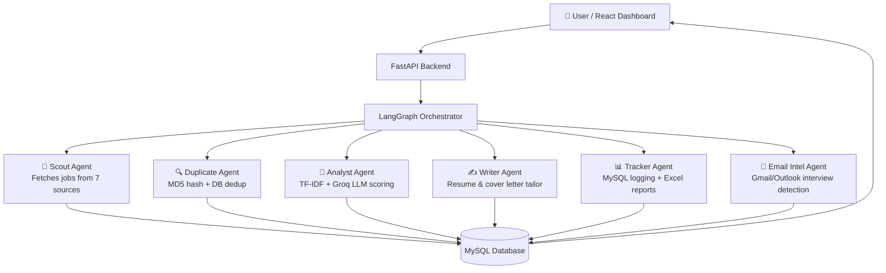

# 🤖 JobPilot AI — Multi-Agent Job Application System

> Your personal AI recruiter that never sleeps.

[](https://python.org)
[](https://langchain-ai.github.io/langgraph/)
[](https://fastapi.tiangolo.com)
[](https://react.dev)
[](https://mysql.com)
[](https://groq.com)

**MS Data Science Capstone Project · University of New Haven · 2026**  
Student: Venkatasaikumar Erla

---

## 🎯 What Is JobPilot AI?

JobPilot AI is a **multi-agent AI system** that automates the entire job application pipeline — from discovering jobs across 7 platforms, scoring them against your resume using a hybrid TF-IDF + LLM matching algorithm, generating tailored resumes and cover letters, to tracking every application in a MySQL database and adapting recommendations based on real outcomes.

---

## 🏗️ Architecture



> **Why LangGraph over vanilla LangChain?** LangGraph provides a stateful, cyclic computation graph — agents can loop, branch on conditions, and share typed state across the pipeline. Vanilla LangChain chains are linear and stateless, which made it impossible to model feedback loops like adaptive pattern learning or multi-step duplicate detection without workarounds.

---

## ✨ Key Features

- **7-Source Job Discovery** — Fetches live listings from Adzuna, Remotive, Himalayas, Jobicy, Arbeitnow, USAJobs, and Google Jobs with a unified schema
- **Hybrid LLM Matching** — Combines TF-IDF cosine similarity (40%) with Groq Llama 3.1 semantic scoring (60%) to rank every job as APPLY / CONSIDER / SKIP
- **Two-Layer Deduplication** — In-memory MD5 hash dedup runs first; a second agent cross-checks the database to filter already-applied roles
- **AI Resume Tailoring** — Writer Agent uses Groq Llama 3.1 to rewrite bullet points and generate a personalised cover letter for each job description
- **Adaptive Pattern Learning** — Tracks which companies, titles, and platforms result in callbacks and automatically adjusts future scoring weights

---

## 🛠️ Tech Stack

| Layer | Technology |
|---|---|
| Agent Orchestration | LangGraph |
| LLM | Groq Llama 3.1 (fast, free tier) |
| Backend API | FastAPI + Python 3.11 |
| Frontend | React 18 + TypeScript + Tailwind CSS |
| Database | MySQL 8.0 |
| Job Sources | Adzuna · Remotive · Himalayas · Jobicy · Arbeitnow · USAJobs · Google Jobs |
| Resume Processing | python-docx · PyYAML |
| Scoring | scikit-learn TF-IDF |
| Reports | openpyxl |

---

## 📸 Screenshots

> _Dashboard, job review, and resume tailor screens — coming soon_

| Dashboard | Job Review | Resume Tailor |
|---|---|---|
|  |  |  |

---

## 🚀 Setup

### Prerequisites
- Python 3.11+
- Node.js 18+
- MySQL 8.0
- Free [Groq API key](https://console.groq.com)

### Installation

```bash
# 1. Clone
git clone https://github.com/phoneixvenkat/ai-job-agent.git
cd ai-job-agent

# 2. Python environment
python -m venv .venv
source .venv/bin/activate        # Mac/Linux
.venv\Scripts\activate           # Windows

pip install -r requirements.txt

# 3. Frontend
cd frontend && npm install && cd ..

# 4. MySQL setup
mysql -u root -p -e "CREATE DATABASE jobpilot;"

# 5. Environment variables
cp .env.example .env
# Edit .env and fill in:
#   GROQ_API_KEY=your_key_here
#   MYSQL_HOST=localhost
#   MYSQL_USER=root
#   MYSQL_PASSWORD=your_password
#   MYSQL_DATABASE=jobpilot
```

### Run

```bash
# Terminal 1 — Backend
uvicorn backend.main:app --reload

# Terminal 2 — Frontend
cd frontend && npm start
```

Open [http://localhost:3000](http://localhost:3000)

---

## 📁 Project Structure

```
ai-job-agent/
├── agents/              # LangGraph AI agents
│   ├── orchestrator.py  # LangGraph state machine
│   ├── scout_agent.py   # Job discovery
│   ├── analyst_agent.py # TF-IDF + LLM scoring
│   ├── writer_agent.py  # Resume & cover letter tailoring
│   ├── duplicate_agent.py
│   ├── tracker_agent.py
│   └── email_agent.py
├── backend/             # FastAPI server + routes + schemas
├── frontend/            # React + TypeScript dashboard
├── database/            # MySQL models & connection
├── job_sources/         # 7 job platform scrapers
├── intelligence/        # Adaptive pattern learning
├── reports_gen/         # Excel & PDF report generation
└── data/                # Resume YAML + bullet bank
```

---

## 👤 Author

**Venkatasaikumar Erla**  
[GitHub](https://github.com/phoneixvenkat) · [LinkedIn](https://linkedin.com/in/venkata-sai-kumar-erla) · [Email](mailto:venkatasaikumarerla@gmail.com)

---

## 📄 License

MIT — see [LICENSE](LICENSE)
